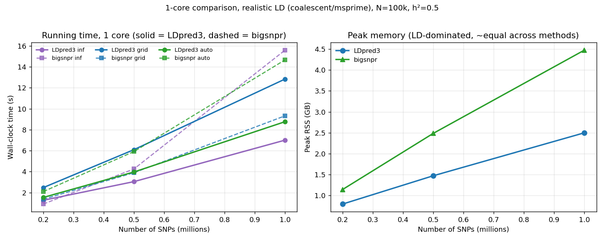

# iprs — iPSYCH PRS

## pyLDpred2

**pyLDpred2** is a dependency-light (NumPy only, optional Numba) Python
implementation of [LDpred2](https://doi.org/10.1093/bioinformatics/btaa1029),
plus a complete polygenic-score (PRS) pipeline around it. It provides:

- the three LDpred2 models — **inf**, **grid**, **auto** — that re-weight GWAS
  marginal effects using an LD correlation matrix;
- an **end-to-end pipeline** from GWAS summary statistics + genotype files
  (PLINK / BGEN) → QC → harmonisation → LD → per-individual scores;
- **LDpred2-auto inference** of heritability, polygenicity and the PRS's
  out-of-sample r² with no validation set (Privé et al. 2023).

It matches the reference R implementation (`bigsnpr`) on accuracy while using
**~2× less memory**, and scales to 2M SNPs single-threaded. See
[docs/benchmarks.md](docs/benchmarks.md) for the full head-to-head.

### Install

```bash
pip install numpy           # the only hard dependency
pip install numba           # optional, strongly recommended (large sampler speed-up)
pip install msprime         # optional, only for realistic-LD simulation
```

### Quick start — full PRS pipeline

```bash
pyldpred2-prs --sumstats gwas.txt.gz --plink target --method auto --out prs.txt
pyldpred2-prs --sumstats gwas.txt.gz --bgen  target.bgen --out prs.txt
```

```python
from pyldpred2 import run_ldpred2_prs
res = run_ldpred2_prs("gwas.txt.gz", "target", method="auto")
res.scores          # per-individual PRS
res.qc_log          # per-filter QC counts
```

Sumstats QC (sample-size / MAF / INFO / duplicate / chi-sq + an SD-consistency
check against the reference panel) runs by default. Full details, supported file
formats and the module breakdown are in [docs/pipeline.md](docs/pipeline.md).

### Models

| Function          | Model                                              | Hyper-parameters     |
|-------------------|----------------------------------------------------|----------------------|
| `ldpred2_inf`     | Infinitesimal (all variants causal, closed form)   | `h2`                 |
| `ldpred2_grid`    | Point-normal / spike-and-slab (Gibbs sampler)      | `h2`, `p` (fixed)    |
| `ldpred2_auto`    | Point-normal, estimates `h2` and `p` automatically | none (self-tuning)   |

Helpers: `standardize_betas`, `ldpred2_by_blocks` (run a model per LD block,
genome-wide), `block_diagonal_ld`, `optimal_ld_blocks`.

```python
import numpy as np
from pyldpred2 import standardize_betas, ldpred2_auto

# beta, beta_se, n_eff: GWAS summary stats for one LD block;
# corr: the (m x m) LD correlation matrix for those variants.
beta_hat, scale = standardize_betas(beta, beta_se, n_eff)
res = ldpred2_auto(corr, beta_hat, n_eff)
adjusted_beta = res.beta_est * scale     # back to the input scale
print(res.h2_est, res.p_est)             # estimated heritability & causal fraction
```

### Inferring h², polygenicity & predictive r²

`ldpred2_auto_infer` runs many LDpred2-auto chains (with chain QC) and
returns heritability, polygenicity and the **out-of-sample predictive r²**, each
with a 95% credible interval and **no validation set** (Privé et al., *AJHG*
2023):

```python
from pyldpred2 import ldpred2_auto_infer
res = ldpred2_auto_infer(corr, beta_hat, n_eff, n_chains=10)
res.h2_est, res.p_est, res.r2_est        # point estimates (+ *_ci for intervals)
```

The inferred r² tracks the PRS's held-out R² (e.g. 0.485 inferred vs 0.495
held-out at N=8000). Details and validation in
[docs/inference.md](docs/inference.md).

### Performance vs bigsnpr (single core, realistic LD)



Accuracy is **identical** to bigsnpr at every size and method. Memory is
**~2× lower**. Speed is method-dependent: `-auto` is ~1.1–1.4× faster, `-inf`
is on par, and `-grid` is ~2× slower (bigsnpr's compiled C++ grid sampler). Both
scale to 2M SNPs single-threaded (pyLDpred2 ~4 GB, bigsnpr ~8 GB). Full tables,
scaling studies and the genotype-level simulation are in
[docs/benchmarks.md](docs/benchmarks.md).

### Key features

- **Fast Gibbs sampler** — running `R·β` residual, fused float32 rank-1 update,
  Rao-Blackwellized estimates, optional Numba JIT.
- **Global hyper-parameters for `-auto`** via a streaming sampler that never
  materialises a genome-wide LD matrix (~34× less RAM at 2M SNPs).
- **Sparse / banded LD** backend with an iterative (CG) `inf` solver.
- **Optimal LD-block splitting** (Privé 2022).
- **Per-variant priors** (`prior_weights`) — annotation-informed causal
  probabilities, SBayesRC-style — either supplied, or **learned inside the
  sampler** (`ldpred2_auto_annot`, EB or probit) returning enrichment estimates.
- **Warm start & adaptive stopping** to cut iterations.

All of these are described in [docs/algorithm.md](docs/algorithm.md).

### Conventions

Effects are on the standardized scale, where marginal effects relate to the true
joint effects through the LD matrix `R`:

```
beta_hat = R @ beta + noise,   noise ~ N(0, R / N)
```

with `N` the GWAS sample size. Use `standardize_betas(beta, beta_se, n_eff)` to
convert reported GWAS effects to this scale and to recover the back-transform.

### Tests

```bash
python -m pytest tests/          # full assertion suite
python -m pytest tests/test_ldpred2.py     # prints recovery of true effects on simulated data
```

### Documentation

- [docs/pipeline.md](docs/pipeline.md) — end-to-end PRS pipeline, QC, file formats
- [docs/inference.md](docs/inference.md) — h² / polygenicity / predictive-r² inference
- [docs/benchmarks.md](docs/benchmarks.md) — full benchmarks, scaling, genotype-level simulation
- [docs/algorithm.md](docs/algorithm.md) — sampler internals, sparse LD, LD splitting, warm start
