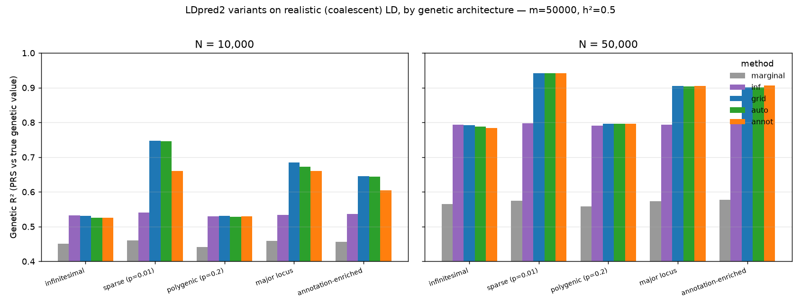

# Benchmarks

All benchmarks are single-core unless noted. Regenerate the bigsnpr comparison
with `benchmarks/bench_vs_bigsnpr.py` (the from-scratch driver: shared
simulation → both tools → `benchmarks/cores_1core_benchmark.csv`; R side in
`benchmarks/bench_bigsnpr_blocks.R`; plot with `benchmarks/plot_methods_1core.py`).

## vs bigsnpr (realistic LD, 200k–2M SNPs, single core)

The benchmark uses **realistic LD** — each block is a `k`-SNP correlation matrix
from a coalescent-with-recombination simulation (msprime: haplotype plateaus,
recombination valleys, a heavy decay tail and perfect-LD duplicates), not
idealized AR(1). Both tools see the **same** simulation, sumstats and
hyper-parameters at each size (h²=0.5, p=0.01, N=50,000, burn-in 100 / 200
iterations); each runs on a **single core** (NumPy BLAS and R BLAS pinned to one
thread); bigsnpr's on-disk SFBM is assembled **incrementally** block-by-block
(`as_SFBM` + `$add_columns()`, as in the LDpred2 vignette) so the full
correlation never sits in RAM. To be apples-to-apples, **both** `auto` runs are
warm-started at the oracle hyper-parameters (LDpred3 `h2_init`/`p_init`,
bigsnpr `h2_init`/`vec_p_init`) — otherwise bigsnpr's auto gets the truth while
LDpred3's cold-starts and under-converges at scale.


Wall-clock time (s), single core:

| #SNPs | inf py / big | grid py / big | auto py / big |
|-------|-------------:|--------------:|--------------:|
| 200k  | **2.7** / 3.0 | 5.6 / **2.6** | **2.6** / 3.9 |
| 500k  | **4.9** / 6.1 | 13.9 / **7.5** | **7.1** / 11.3 |
| 1M    | 9.8 / **8.7** | 27.7 / **15.2** | **14.1** / 21.8 |
| 2M    | 19.7 / **15.2** | 55.2 / **31.0** | **28.0** / 44.5 |

Peak memory (GB) — LD-dominated, so ~equal across the three methods:

| #SNPs | LDpred3 | bigsnpr | ratio |
|-------|----------:|--------:|------:|
| 200k  | **0.60** | 1.05 | 1.8× |
| 500k  | **1.20** | 2.29 | 1.9× |
| 1M    | **2.23** | 4.39 | 2.0× |
| 2M    | **4.28** | 8.57 | 2.0× |

**Prediction accuracy is identical** between the two at every size and method —
e.g. auto phenotype-scale R² 0.388/0.388 at 200k → 0.103/0.102 at 2M (the level
falls with #SNPs because the GWAS power N is fixed; R²_pheno = genetic-R² × h²,
h²=0.5).

The picture is method-dependent — there is no blanket "N× faster":

- **Memory:** LDpred3 is **~2× leaner**, the gap widening from 1.8× at 200k to a
  clean 2.0× at 2M (`float32` LD + one block resident; bigsnpr's SFBM stores
  `float64` values plus per-entry indices).
- **`-auto`:** LDpred3 is **~1.5–1.6× faster** at matched initialization — its
  streaming global-hyper sampler is the strongest path.
- **`-inf`:** roughly on par — LDpred3 faster up to 500k, bigsnpr faster at
  1–2M (its compiled solve scales a little better on the largest blocks).
- **`-grid`:** **bigsnpr is ~1.8–2× faster** here; its compiled C++ grid sampler
  beats LDpred3's per-block Python-orchestrated one. This is LDpred3's weak
  spot at fixed hyper-parameters.

## End-to-end pipeline vs bigsnpr

Beyond the per-block accuracy check above, the **whole pipeline** was validated
against bigsnpr: the same simulated PLINK target + GWAS sumstats + in-sample LD
were run through LDpred3's complete pipeline (QC → harmonise → per-block LD →
`-auto` → scoring) and through bigsnpr's `snp_ldpred2_auto`, and the
per-individual polygenic scores compared.

| metric | result |
|--------|--------|
| PRS correlation (LDpred3 vs bigsnpr) | **r = 0.9995** |
| R² vs true genetic value | 0.567 (LDpred3) / 0.575 (bigsnpr) |

So the pipeline glue — allele harmonisation, QC, LD construction and scoring —
reproduces bigsnpr's polygenic scores essentially exactly. (Validation against a
downloaded public GWAS + 1000 Genomes reference is the natural next step; it adds
real-data quirks the simulation can't, but needs multi-GB inputs.)

## Methods by genetic architecture (realistic LD)

How do the LDpred3 variants compare across genetic architectures? The genome is
100 distinct coalescent/msprime LD blocks of 500 SNPs (m=50,000, h²=0.5); for
each architecture we simulate true effects, generate summary statistics, fit
every method, and measure the **genetic R²** — the squared correlation between
the PRS and the true genetic value under population LD,
`(β̂ᵀRβ)² / [(β̂ᵀRβ̂)(βᵀRβ)]` — averaged over 5 replicates. `grid` is given the
oracle `(h²,p)`; `annot` gets one functional annotation (informative only in the
last row). Regenerate with `benchmarks/bench_methods.py` /
`benchmarks/plot_methods_arch.py`.



Genetic R² at **N = 10,000** (the lower-power regime separates the methods):

| architecture | marginal | inf | grid | auto | annot |
|--------------|---------:|----:|-----:|-----:|------:|
| infinitesimal       | 0.451 | **0.532** | 0.531 | 0.526 | 0.527 |
| sparse (p=0.01)     | 0.460 | 0.541 | **0.747** | 0.746 | 0.747 |
| polygenic (p=0.2)   | 0.442 | 0.530 | **0.531** | 0.528 | 0.529 |
| major locus         | 0.459 | 0.533 | **0.684** | 0.672 | 0.672 |
| annotation-enriched | 0.457 | 0.536 | 0.646 | 0.644 | **0.662** |

Genetic R² at **N = 50,000** (higher power; everything shifts up and compresses):

| architecture | marginal | inf | grid | auto | annot |
|--------------|---------:|----:|-----:|-----:|------:|
| infinitesimal       | 0.565 | **0.794** | 0.792 | 0.789 | 0.789 |
| sparse (p=0.01)     | 0.575 | 0.797 | 0.941 | 0.942 | **0.942** |
| polygenic (p=0.2)   | 0.559 | 0.791 | **0.797** | 0.797 | 0.796 |
| major locus         | 0.574 | 0.794 | **0.904** | 0.903 | 0.903 |
| annotation-enriched | 0.577 | 0.796 | 0.900 | 0.901 | **0.908** |

Takeaways:

- **The raw marginal PRS is always far behind** — the LD adjustment is the
  first-order win (≈0.45→0.53 at N=10k, ≈0.57→0.79 at N=50k).
- **`inf` is architecture-robust but flat**: it is the best model *only* under a
  truly infinitesimal (or near-infinitesimal polygenic) architecture, and leaves
  large gains on the table whenever the trait is sparse or has major loci.
- **`grid`/`auto` win decisively on sparse and major-locus** architectures
  (e.g. 0.75/0.68 vs 0.53 for `inf` at N=10k) — the spike-and-slab captures
  concentrated signal. **`auto` matches the oracle `grid`** (handed the true
  `h²` and `p`) without any hyper-parameters — the practical default.
- **`annot` matches `auto` when the annotation is uninformative and beats it
  when it carries signal.** On the annotation-enriched architecture it is the
  best method at both power levels (N=10k: 0.662 vs grid 0.646; N=50k: 0.908 vs
  0.901), and it never falls behind `auto` elsewhere. The lift from a *single*
  binary annotation is modest — SBayesRC's larger real-data gains come from many
  S-LDSC-calibrated annotations — but it is consistent and free of the
  "garbage-in" penalty a *fixed* bad prior would carry.

> **Convergence note (why this is the corrected table).** An earlier run with a
> lazy annotation-map update (`theta_every=10`) had `annot` *underperforming*
> `auto` at N=10k — e.g. enriched 0.60 vs 0.64. That was an artifact: with short
> chains the `p_j = sigmoid(Aθ)` map had not converged, so it over-estimated the
> global `p` (effective p ≈ 0.04 vs a true 0.02) and **over-shrank** the effects.
> Updating `θ` every sweep (now the default — the IRLS step is cheap for a
> handful of annotations) lets the map and the effects co-adapt; the learned
> enrichment then reaches its true value (θ_func ≈ 1.7) and the anomaly
> disappears. A diagnostic confirmed the fix is purely about convergence: more
> iterations *without* frequent θ updates also fixed it, but added nothing on top
> of `theta_every=1`.

### Per-method running time

Fit time on the same setup (m=50,000 = 100 coalescent blocks of 500, single
core, burn-in 80 / 200 sampling sweeps; `inf` is a direct per-block solve).
Regenerate with `benchmarks/timing_bench.py`.

| method | fit time (s) |
|--------|-------------:|
| inf    | 0.56 |
| auto   | 2.13 |
| grid   | 2.20 |
| annot  | 3.99 |

`inf` is cheapest (one linear solve per block, no sampling). `grid`/`auto` are
the spike-and-slab Gibbs samplers and cost about the same. `annot` is ~1.9×
`auto`: it runs the same per-block effect sweeps plus a logistic annotation-map
update every sweep.

**Cost of the annotation learner (`annot`).** The θ-update is an `O(m·K²)` IRLS
solve in the number of annotations `K`, run every `theta_every` sweeps. Fit time
(s) at m=50,000:

| #annotations K | `theta_every=1` (default) | `theta_every=10` |
|---------------:|--------------------------:|-----------------:|
| 1   | 4.0  | 2.6 |
| 5   | 4.5  | 2.6 |
| 20  | 6.4  | 2.8 |
| 50  | 10.5 | 3.1 |
| 100 | 22.9 | 4.4 |

So the convergence-correct default (`theta_every=1`) is nearly free for a handful
of annotations but its `O(K²)` per-sweep cost takes over by `K ≈ 50`; with many
annotations raise `theta_every` to amortise it. (Persisting the running `R@β`
residual across chunks — rather than rebuilding it each θ-update — keeps the
default cheap; without it `annot` was ~3× `auto` instead of ~1.9×.)

## Genotype-level simulation

`ldpred3/simulate.py` is a full end-to-end simulation: it generates genotypes with
block LD, simulates a phenotype under a chosen heritability and polygenicity,
runs a marginal GWAS, estimates the LD matrix from the training sample, fits
LDpred3, and reports **out-of-sample** prediction R² on a held-out test set. It
sweeps a grid of polygenicity × heritability × sample size.

To stay within memory at scale, genotypes are stored as `int8` dosages and
every step (standardization, GWAS, LD, PRS) is processed one LD block at a time,
so a full float genotype matrix is never materialised.

**LD model (`--ld-model`).** Two choices for the LD between SNPs:

* `ar1` (default): a latent-Gaussian model with geometric LD decay
  (`r ≈ ρ^dist`). Fast and dependency-free, but idealized — LD collapses to ~0
  within a handful of SNPs.
* `coalescent`: realistic LD from a coalescent-with-recombination simulation
  (via [msprime](https://tskit.dev/msprime), human-like Ne=10⁴ and 1e-8 recomb/
  mutation rates). This produces actual haplotype blocks, recombination
  hotspots, a heavy LD decay tail and sporadic long-range LD — the structure of
  real reference panels (mean r² stays ~0.02 at 200 SNPs apart, vs ~0 for AR(1)).

LDpred3's advantage over the raw marginal PRS is *larger* under realistic LD
(e.g. h²=0.5, p=0.01: marginal 0.21 → grid/auto 0.43 with coalescent LD, vs
0.32 → 0.50 with AR(1)), because realistic long-range LD inflates the naive
score that LDpred3's LD-adjustment removes.

```bash
python -m ldpred3.simulate --quick                        # fast (AR(1))
python -m ldpred3.simulate --quick --ld-model coalescent  # realistic LD (needs msprime)
python -m ldpred3.simulate --csv sim.csv                  # full accuracy grid, save results
```

Representative results (m=10000 SNPs, blocks of 200, AR(1) LD; prediction R² vs
phenotype):

| N | h² | p (causal) | marginal | inf | grid | auto | ceiling |
|---|----|-----------|---------|-----|------|------|---------|
| 5000  | 0.5 | 0.001 | 0.097 | 0.100 | 0.465 | 0.465 | 0.475 |
| 20000 | 0.5 | 0.001 | 0.254 | 0.262 | 0.489 | 0.489 | 0.489 |
| 20000 | 0.5 | 0.1   | 0.245 | 0.265 | 0.417 | 0.417 | 0.512 |
| 20000 | 0.3 | 0.01  | 0.135 | 0.139 | 0.301 | 0.300 | 0.311 |

LDpred3 always beats the raw marginal baseline; accuracy rises with heritability
and sample size; `grid`/`auto` approach the ceiling for sparse architectures and
remain best across the grid. The infinitesimal model only modestly beats the
marginal score — its all-causal prior leaves accuracy on the table whenever the
trait is even mildly sparse.

## Scaling: what the algorithm actually depends on

The LDpred3 *algorithm* works from summary statistics + the LD matrix, so its
cost is **independent of the GWAS sample size N** and is driven instead by the
**LD structure (block size)**. The benchmarks below separate the algorithm's
`fit` time from the simulation/GWAS/LD-construction `prep` time (which does scale
with N). Measured on a 4-core / 15 GB box, Numba on, h²=0.5, p=0.01.

**Independent of N** (`--n-independence`, m=10000, blocks of 200): fit time is
flat while prep grows with N.

| N_train | prep (s) | fit_grid (s) | fit_auto (s) |
|---------|---------|--------------|--------------|
| 2000   | 4.1  | 0.200 | 0.367 |
| 8000   | 10.4 | 0.199 | 0.305 |
| 32000  | 46.9 | 0.195 | 0.270 |

**Driven by LD block size** (`--ld-scaling`, m=20000 fixed, N=8000): larger LD
blocks make each block's solve/sampler costlier. The infinitesimal model is a
dense linear solve per block (≈O(m·k²), grows fast), whereas the Gibbs samplers
stay nearly flat for sparse traits thanks to the running-residual update.

| block size | #blocks | fit_inf (s) | fit_grid (s) | fit_auto (s) |
|-----------|---------|-------------|--------------|--------------|
| 100   | 200 | 0.076 | 0.379 | 0.664 |
| 250   | 80  | 0.105 | 0.402 | 0.680 |
| 500   | 40  | 0.167 | 0.398 | 0.731 |
| 1000  | 20  | 0.347 | 0.410 | 0.468 |
| 2000  | 10  | 1.082 | 0.469 | 0.541 |

**Scaling #SNPs** (`--scaling`, N=8000, blocks of 200): with N fixed, total
runtime and memory grow ~linearly in #SNPs (≈1 ms/SNP; memory bounded by the
`int8` genotype matrix). Accuracy falls only because more SNPs/causal variants
dilute the fixed GWAS power — `grid` degrades gracefully while raw
`marginal`/`inf` collapse.

| #SNPs | prep (s) | fit (s) | peak mem (GB) | marginal | inf | grid | auto | ceiling |
|-------|---------|--------|---------------|---------|-----|------|------|---------|
| 10000  | ~10 | ~0.7 | 0.30 | 0.167 | 0.174 | 0.465 | 0.452 | 0.503 |
| 50000  | ~46 | ~3.5 | 0.74 | 0.051 | 0.050 | 0.316 | 0.264 | 0.485 |
| 100000 | ~98 | ~7   | 1.28 | 0.016 | 0.015 | 0.181 | 0.115 | 0.482 |

Practical takeaway: for dense data with long-range / large LD blocks, the dense
per-block LD storage and the infinitesimal solve become the bottleneck, which
motivates the banded / sparse-LD backend (see [algorithm.md](algorithm.md)).

## Robustness: LD reference quality & sample size

How sensitive is the PRS to two things you don't control perfectly in practice —
the LD reference panel and the GWAS sample size? Both fit LDpred3-`auto` on
summary statistics generated from the true coalescent LD (m=6000, h²=0.5,
p=0.01, N=50000) and report the held-out **genetic R²** and the fitted genetic
variance (an h² proxy). Regenerate with `benchmarks/robustness_ld_and_n.py`.

**LD reference panel size** (`Nref`), the dominant real-world error — the LD is
estimated from `Nref` reference individuals rather than known exactly:

| Nref | pred R² | h² proxy |
|------|--------:|---------:|
| 500   | 0.825 | 0.910 |
| 1000  | 0.912 | 0.672 |
| 2000  | 0.965 | 0.560 |
| 5000  | 0.984 | 0.521 |
| 10000 | 0.989 | 0.514 |
| ∞ (true LD) | 0.992 | 0.493 |

A **small panel is actively harmful**: at Nref=500 the noisy LD makes the sampler
over-fit, inflating h² to 0.91 (true 0.5) and dropping R² to 0.83. Accuracy is
near-clean only by **Nref≈5000**; a 1000-Genomes-scale panel (~2000) already
costs ~3% R² and a ~12% h² over-estimate. This is the systematic bias behind the
0% interval coverage in [inference.md](inference.md#interval-calibration) — use
the largest matched-ancestry panel you can.

**Sample-size misspecification** — fitting with the wrong `N` (Nref=2000):

| N_used / N_true | pred R² | h² proxy |
|-----------------|--------:|---------:|
| 0.70 | 0.979 | 0.533 |
| 0.85 | 0.972 | 0.547 |
| 1.00 | 0.965 | 0.560 |
| 1.15 | 0.958 | 0.574 |
| 1.30 | 0.951 | 0.586 |

LDpred3-`auto` is **fairly robust to N**: ±30% changes R² by only ~±1.5% and
moves the h² proxy roughly in proportion to `N_used`. There is even a mild twist
— slightly *under*-stating `N` (0.70–0.85) predicts a touch **better** here,
because the extra shrinkage offsets the over-fit that noisy reference LD induces.
A correct (or mildly conservative) `N` is fine; a wildly wrong one mostly
mis-scales the heritability.

## Accuracy across polygenicity, heritability and sample size

How does PRS accuracy move with the three things that vary most across real
traits? Each axis is swept from a baseline (p=0.01, h²=0.5, N=50000), holding the
other two fixed, on realistic reference-panel LD (m=8000, Nref=2000, coalescent;
genetic R² = squared correlation of the PRS with the true genetic value).
`inf` is given the true h² (oracle); `auto` self-tunes. Regenerate with
`benchmarks/sweep_p_h2_n.py`.

**Sample size N** (p=0.01, h²=0.5):

| N | marginal | inf | auto |
|--------|---------:|----:|-----:|
| 10000  | 0.585 | 0.812 | 0.946 |
| 50000  | 0.609 | 0.911 | **0.969** |
| 200000 | 0.614 | 0.935 | 0.950 |

`auto` is strong even at N=10k and rises to ~0.97 — but note it **dips slightly at
N=200k while `inf` keeps climbing**. That is the *reference-LD ceiling*: with a
finite reference panel (Nref=2000), more GWAS data makes the sampler trust the
(mismatched) LD harder and over-fit relative to the true LD. At very large N a
better LD reference matters more than more samples (see
[LD reference quality](#robustness-ld-reference-quality--sample-size)).

**Heritability h²** (p=0.01, N=50000):

| h² | marginal | inf | auto |
|-----|---------:|----:|-----:|
| 0.1 | 0.585 | 0.812 | 0.948 |
| 0.3 | 0.605 | 0.891 | **0.971** |
| 0.5 | 0.609 | 0.911 | 0.969 |
| 0.8 | 0.611 | 0.923 | 0.963 |

Genetic R² (PRS vs the *genetic* value) is fairly flat in h² for `auto` — the
metric normalises out the heritability, so what it shows is that `auto` recovers
the genetic component well across the range, given enough power. (`inf` improves
with h² because higher h² sharpens its dense per-SNP estimates.) Phenotype-scale
R² would instead scale ~linearly with h².

**Polygenicity p** (h²=0.5, N=50000):

| p | marginal | inf | auto |
|-------|---------:|----:|-----:|
| 0.001 | 0.599 | 0.914 | **0.969** |
| 0.01  | 0.609 | 0.911 | **0.969** |
| 0.1   | 0.618 | 0.910 | 0.922 |
| 1.0 (infinitesimal) | 0.603 | 0.912 | 0.905 |

This is the clearest axis: `auto` **excels on sparse architectures** (0.97 at
p≤0.01) and **degrades toward the infinitesimal limit** (0.905 at p=1), where its
spike-and-slab is mildly mis-specified and the matched `inf` model (0.912) edges
it. `inf` is flat ~0.91 across p by construction (it assumes all variants causal,
so sparsity neither helps nor hurts it). The practical reading: `auto` is the
right default — it wins wherever there is concentrated signal and is only a hair
behind a perfectly-matched `inf` when the trait is truly infinitesimal.

## DENTIST LD-consistency filter

Does the optional DENTIST filter (`--dentist`) actually recover accuracy when the
sumstats contain LD-inconsistent errors, and what does it cost on clean data?
This plants spurious genome-wide-significant hits at **non-causal** variants (an
allele/strand error that inflates a null variant's z out of line with its LD
neighbours), fits LDpred3-`auto` with and without the filter, and reports genetic
R². AR(1) LD, m=4000 (20×200 blocks), Nref=10k, N=10k, h²=0.5, p=0.05, 5 reps.
Regenerate with `benchmarks/dentist_recovery.py`.

| condition | genetic R² |
|-----------|-----------:|
| clean (no errors) | 0.911 |
| corrupted, no filter | 0.512 |
| corrupted, `--dentist` | **0.684** |

30 planted errors/rep; DENTIST catches **96%** of them. On *clean* sumstats it
drops **0.59%** of genuine variants (the false-positive cost).

Reading: a handful of LD-inconsistent false hits roughly halves the PRS (0.91 →
0.51) because the LD adjustment propagates them to their neighbours; DENTIST
recovers most of the loss (→ 0.68). But it is **not free** — it drops ~0.6% of
genuine variants even with nothing wrong, and that cost climbs steeply with
GWAS power (the per-variant z grows, so well-tagged true signals start tripping
the residual test). That is exactly why it is **off by default**: turn it on when
you suspect allele/strand errors or an LD-reference mismatch, and keep `p_cutoff`
stringent.

## Sparse / banded LD: storage vs accuracy

Real LD is banded, so a dense block wastes memory on ~zero entries.
`sparsify_ld` thresholds and/or distance-bands each block into a CSR `SparseLD`
the sampler updates in O(bandwidth). Storage (density = stored entries / dense),
single-core fit time and genetic R² across settings (AR(1) LD, m=4000 = 8×500
blocks, Nref=5k, N=20k, h²=0.5, p=0.02). Regenerate with
`benchmarks/sparse_ld_tradeoff.py`.

| config | density | fit (s) | R² |
|--------|--------:|--------:|---:|
| dense | 100.0% | 0.10 | 0.983 |
| threshold 1e-2 | 52.3% | 0.09 | 0.982 |
| threshold 1e-3 | 94.9% | 0.10 | 0.983 |
| band max_dist=50 | 19.1% | 0.09 | 0.974 |
| band 25 + shrink 0.9 | 9.9% | 0.08 | 0.972 |

Thresholding at 1e-2 **halves storage for free** (R² 0.982 vs 0.983). Distance
banding is far more aggressive — a 50-SNP band keeps **~19%** of entries and a
25-SNP band with `shrink=0.9` just **~10%**, at a small accuracy cost (~0.01 R²).
Banding can break positive-definiteness, which destabilises the sampler;
`shrink` < 1 restores diagonal dominance (and is why the tightest band stays
accurate). At these block sizes (k=500) the time difference is minor — the win is
memory; the speed win grows with bandwidth.

> **This table is AR(1) LD, which is genuinely banded.** On *realistic* LD,
> distance banding is **lossy** (it discards real long-range structure) — see the
> next section, where low-rank LD is the right memory tool instead.

## LD representations at scale: memory vs running time

At genome / sequencing scale (millions of SNPs, thousands per block) the dense
per-block LD (Σ kᵦ²) does not fit in RAM. The compact representations the sampler
can fit — banded `SparseLD` and low-rank `LowRankLD` — are compared here on
**realistic** coalescent LD with **large blocks** (m=10,000 = 5×2000, N=50k,
h²=0.5, p=0.01): persistent LD memory, build time (low-rank pays an
eigendecomposition), per-fit time, and genetic R². Regenerate with
`benchmarks/ld_representations.py`.

| representation | LD memory | build (s) | fit (s) | R² |
|----------------|----------:|----------:|--------:|---:|
| dense | 80 MB | 3.1 | **0.18** | 0.987 |
| band w200 | 30 MB | 3.2 | 1.9 | 0.758 |
| **low-rank 99.5%** | **16 MB** | 10.2 | 1.6 | **0.986** |

Two costs, and they are different in kind:

* **Build (the eigendecomposition) is one-time and cached.** It is part of LD
  *construction*, not the fit — computed once, saved as the `U` factor (`--ld-out`,
  including the memmap `--ld-stream` cache) and reused across every later fit /
  cohort via `--ld-cache`. So the 10.2 s amortises to ~0 per run, exactly as the
  dense LD's own `Z·Zᵀ` does; it should not be charged to a fit.
* **The recurring cost is fit time.** Low-rank **cuts memory ~5× and matches
  dense accuracy (0.986 vs 0.987) but fits ~9× slower**, and that part does not
  amortise. The slowdown is structural — the dense sampler keeps the full
  residual vector and reads `(Rβ)_j` in O(1), whereas the eigenspace fit
  recomputes `(Rβ)_j = U[j]·s` in O(rank) per SNP. This is intrinsic, not an
  implementation gap: the Gibbs sweep is sequential — `s` changes after every SNP
  — so the reads can't be batched into one `U·s` matvec, and keeping a full
  residual instead would cost O(k) per update (worse).

**Banding is worse on realistic LD on every axis except a small memory edge over
dense** (slower than dense *and* it drops accuracy to 0.76). So low-rank is the
representation for *scale* — LD that would not fit dense — not a way to speed up a
problem that already fits in RAM. For the latter, dense (or recombination-aware
splitting to keep blocks bounded) is best; and the on-disk `--ld-stream` cache
lets a low-rank LD exceed RAM (paged from disk, fits bit-identical).

**Mixed dense + low-rank (`lowrank_min_size`).** Genome-wide, most blocks are
small/moderate and only a few are huge. `compute_ld_blocks(lowrank=True,
lowrank_min_size=K)` (CLI `--ld-lowrank-min-size`) keeps small blocks **dense**
(fast, cheap, often barely compressible) and compresses only blocks ≥ `K`. On a
mixed genome (40×300 + 2×2500 blocks, realistic LD) it is the Pareto choice:

| strategy | LD memory | fit (s) | R² |
|----------|----------:|--------:|---:|
| all dense | 64 MB | 0.26 | 0.979 |
| all low-rank | 14 MB | 1.57 | 0.979 |
| **mixed (≥1000 low-rank)** | 24 MB | **1.12** | 0.978 |

Mixed **dominates all-low-rank** (28 % faster at the same accuracy — small blocks
stay fast dense) and **bounds memory vs all-dense** (only the few huge blocks are
compressed). The big blocks still dominate fit time, so it is the right default
when *some* blocks are too big for dense but most are not — not when everything
already fits dense (then dense is fastest).

## Optimal LD-block splitting

`optimal_ld_blocks` (Privé 2022) places block boundaries in low-LD valleys
instead of at fixed offsets. Here one region is built from unequal true
sub-blocks `[137, 211, 89, 256, 170, 137]` (m=1000) so the fixed cuts land
mid-block; both splits use the same `max_size=250`. Regenerate with
`benchmarks/block_splitting.py`.

| split | #blocks | discarded LD² | storage (Σk²) | R² |
|-------|--------:|--------------:|--------------:|---:|
| fixed | 4 | 116.9 | 250,000 | 0.903 |
| optimal | 5 | **111.3** | **211,235** | **0.912** |

Putting boundaries in the valleys discards **less true between-block LD**, needs
**~16% less** per-block storage, and predicts slightly better — all from cutting
where the LD is already weak rather than through the middle of a haplotype block.

## Numba JIT speed-up

The Gibbs sampler's inner sweep dominates runtime; `ldpred3` JIT-compiles it
with Numba and otherwise runs the *identical* pure-Python code. Same auto fit
(m=2000, burn-in 60 / 150 sampling sweeps), with and without JIT (the script
toggles `NUMBA_DISABLE_JIT` in a subprocess). Regenerate with
`benchmarks/numba_speedup.py`.

| mode | fit time (s) |
|------|-------------:|
| pure Python | 3.70 |
| Numba JIT | 0.03 |

A **~130×** speed-up (machine-dependent) — this is why `pip install numba` is
strongly recommended. Without it everything still runs, just far slower.

## Multi-core scaling (`--ncores`)

The packed auto sampler parallelises its per-sweep block loop with Numba
`prange`. Parallel speed-up and efficiency of one fixed kernel (m=20,000 = 40×500
blocks, burn-in 100 / 200 sweeps, 4-CPU box). Regenerate with
`benchmarks/cores_scaling.py`.

| ncores | fit (s) | speed-up | efficiency |
|-------:|--------:|---------:|-----------:|
| 1 | 5.29 | 1.00× | 100% |
| 2 | 2.48 | 2.13× | 107% |
| 4 | 1.36 | 3.88× | 97% |

Near-linear scaling (~97% efficiency on 4 cores) when there is enough per-block
work. Note `--ncores 1` uses the low-memory *streaming* sampler while
`--ncores > 1` switches to this packed parallel kernel (more memory, parallel
sweeps); for small problems the single-core streaming path can already be fast
enough that the packed kernel's setup isn't worth it.
